# Introduction

ssGSEA taskforce is a standalone desktop software for running Single Sample Gene Enrichment Analysis (ssGSEA) and analyzing ssGSEA results. This tutorial is intended for users who would like to quickly get started by installing the software, running ssGSEA analysis and analyzing their results.

For support, bug reports and updates, please visit:

https://github.com/ayguno

# Download and Software Installation

**Currently only available for WINDOWS**

The latest version of the software is available to download from the following URL:

___

[**DOWNLOAD ssGSEA Taskforce V.0.1**](https://www.dropbox.com/s/3p0mwe38hfutxwj/ssGSEAtaskforce_setup.exe?dl=0)

___

Download the **ssGSEAtaskforce_setup.exe** file into your computer and double click to start the install wizard:

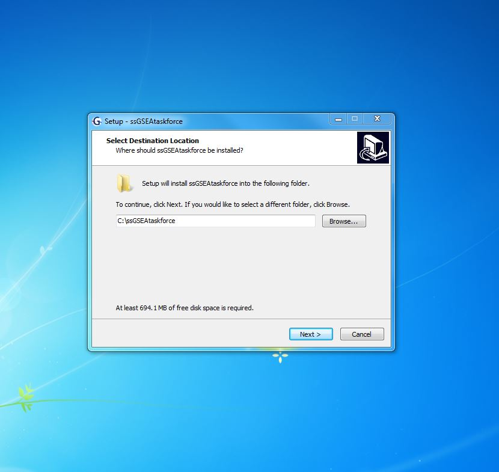

Click to **Next**:

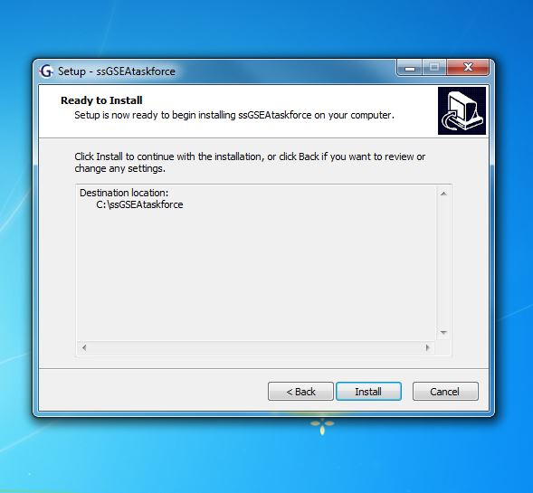

By default, the software will be installed into your C: drive. Click to **INSTALL** to continue.

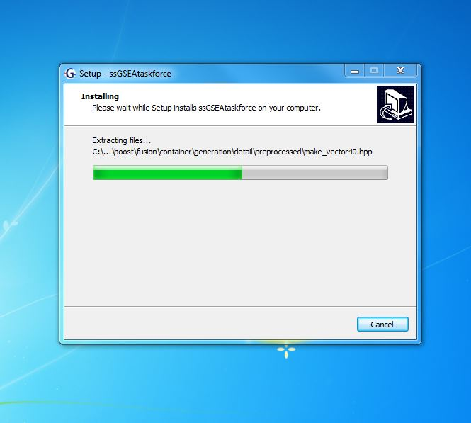

Complete installation:

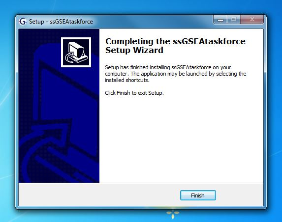

You should see the ssGSEA icon on your desktop. 

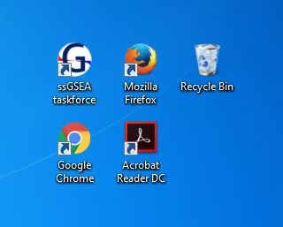

# Main Menu

Click to run the software. A portable version of Google Chrome will open. You will notice it takes some time to load the software in the first instance,as it may ask you to load some extensions of the Adobe Reader in a separate tab. You can ignore and close that tab. The actual software will appear in the tab with a default IP address/port: **//127.0.0.1:8888/**

The main menu will look like:

# Run ssGSEA

## Gene expression data in gct 1.2 format

ssGSEA Taskforce currently supports the gct 1.2 input file format. You will be required to convert your gene expression data set into this format, which is straightforward. 

Here is an intuitive example how a gct 1.2 file looks like:

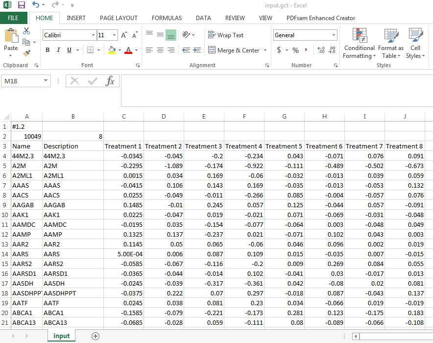

You can prepare your expression file in any software or programming environment you wish. The important points are:

- Give unique names to your treatments (rule of thumb: avoid spaces special characters other than numbers)
- The first two rows are reserved. The left 'corner' has the **#1.2** identifier.
- The second row has to specify the number of Genes in your data set(number of observations) and the number of Treatments, respectively.
- The third row will contain the header.
- The first columns are reserved for gene names: currently supporting official human Gene Symbols, which will become the **Name** and **Description** columns, respectively. Treatment expression data should be listed afterwards.
- For gene expression data, utilization of log2 transformed, median normalized expression ratios are recommended (e.g: Treatment/Control).
- Once your file is ready, save it as a **tab delimited file**, then change the file extension as **.gct**. Unless configured properly as a gct file, your expression set might not be recognized by the software.

## Loading gene expression data and choosing parameters

Click to **Run ssGSEA** to open ssGSEA run wizard:

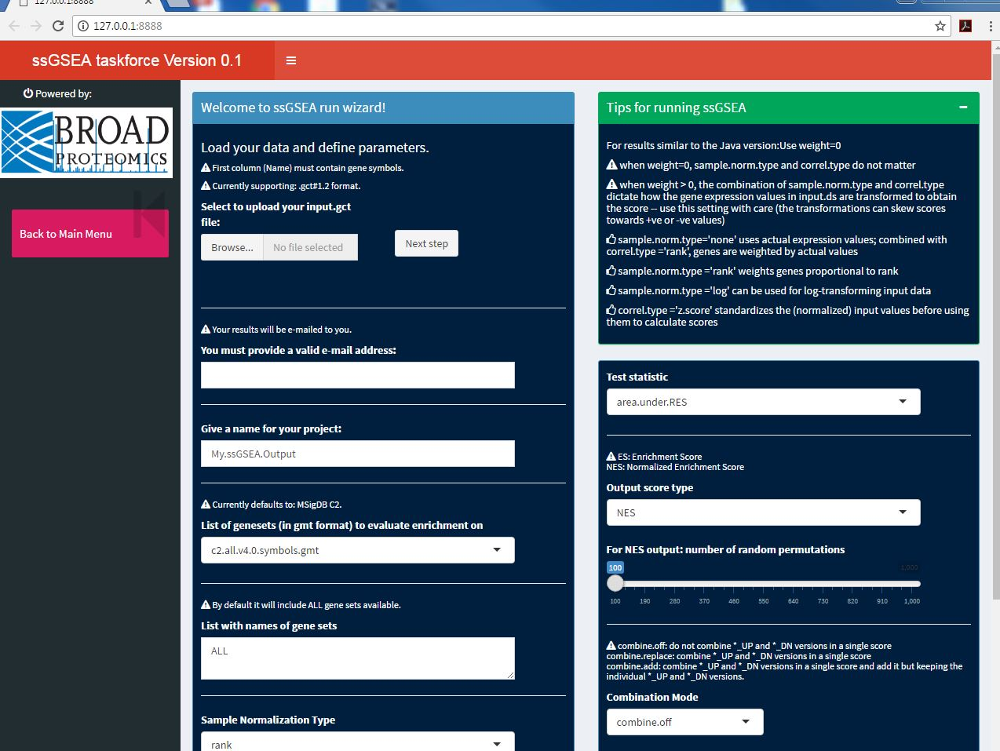

- Upload your expression data set.
- Provide a useful title for your project.
- Choose your parameters: various tips are provided on how to choose your parameters.
- **YOU MUST PROVIDE A VALID E-MAIL ADDRESS**: if you would like to receive your results.

## The ssGSEA run console

Once your parameters are ready, click to move to next stage:

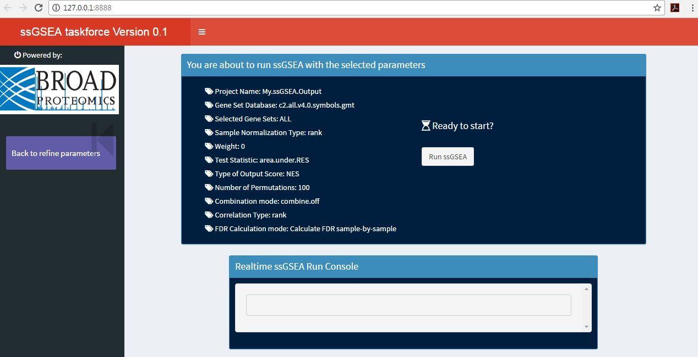

Here you will be asked to review the parameters you defined. Since ssGSEA runs are computationally intensive, it is generally a good idea to check the parameters carefully before starting the run. If you wish to refine your parameters, click **back** and you will be redirected to the refine parameters page.

Once you are ready, click to **run ssGSEA** to start the run.

**DO NOT CLOSE YOUR BROWSER WHEN YOUR ANALYSIS IS RUNNING!**

You will notice the real-time run console will start working. It will start by printing the unique JOB-ID for your task: keep this for your records.

**If you provided your e-mail address**:

- You will receive an e-mail immediately after you started the run, which will also include your unique ssGSEA JOB-ID.
- Once your task is completed, you will again receive an e-mail notification, which will include your results files along with the parameters you used as attachments.

**Once your run is completed, you will be directed back to the main menu.**

# Analyze ssGSEA

Click to **Analyze ssGSEA** to open analysis tools:

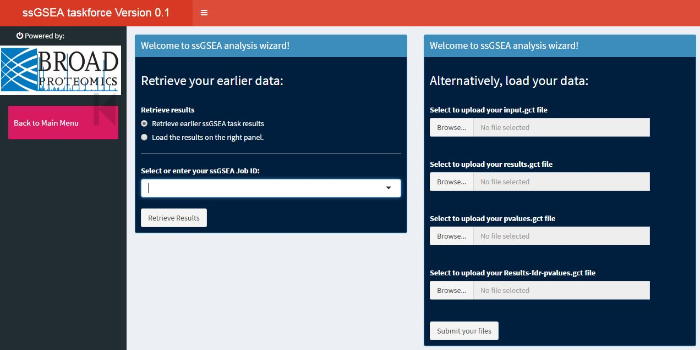

##Retrieve your results

Your results will be accessible to you under the unique JOB-ID you were provided during the run. Just use the pull-down menu to choose the run you are interested in analyzing.

Click: **Retrieve Results**

## Manually load your results files

Alternatively, you can upload the results files yourself. First click to **Load the results on the right panel** radio button, then upload your files on the right. Make sure you upload the various files correctly.

Once you uploaded the files, click: **Submit your files**

##Analysis menu

Once you completed results retrieval/uploading, you will be directed to analysis menu:

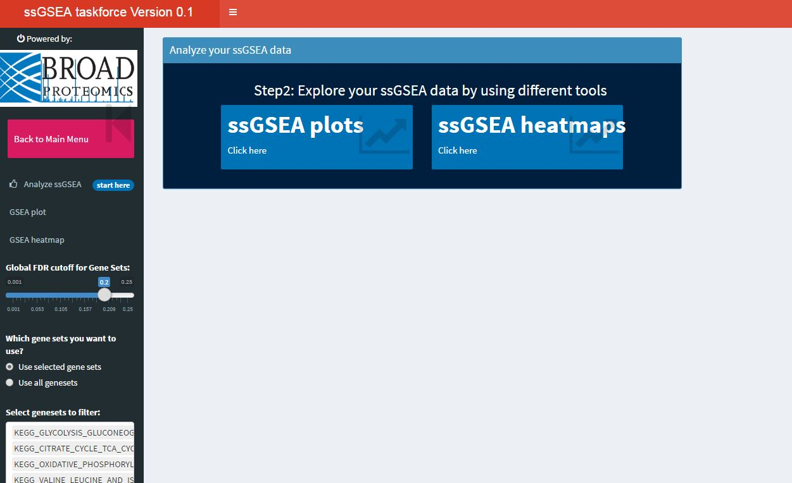

Currently the software can generate ssGSEA gene set stick-plots as well as heatmaps.

The side bar contains a **global** FDR (False Discovery Rate adjusted p-value) filter to be applied on your results, as well as the option to add/exclude gene sets to display on your plots/heatmaps. These options work both for plots and heatmaps.

### ssGSEA plots

The plot will display a rank ordered list of the genes (x-axis) along with their expression values (y-axis) for a given treatment as provided by user. The source code for this plot was adapted from Karsten Krug.

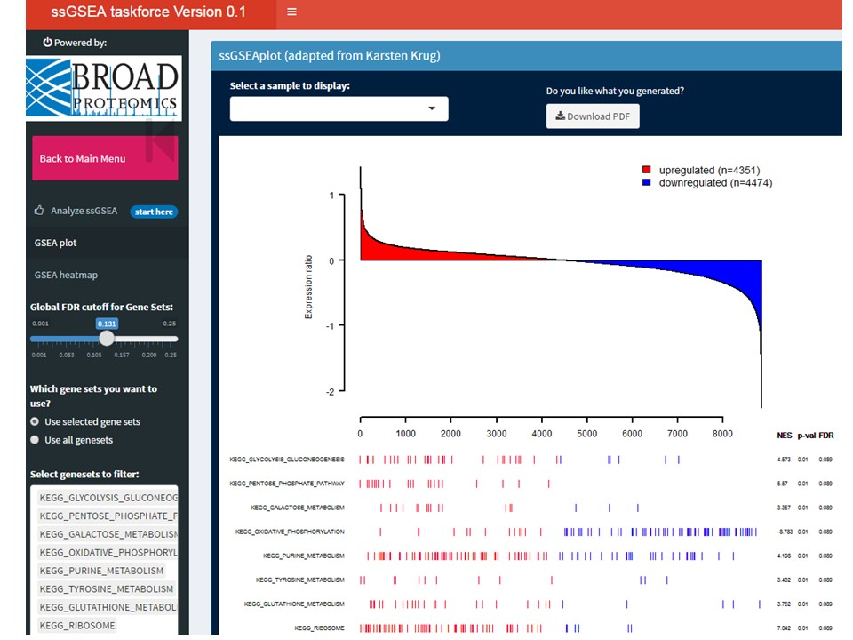

Under the plot, the gene sets that are enriched or depleted in a given treatment will be listed, along with their enrichment score results, p-values and FDR-adjusted p-values. The individual genes within a given gene set, which are present in the expression set will be aligned to their respective ranks and displayed as either red (upregulated) or blue (downregulated).

- The plot will be updated each time user specifies a new global FDR cut off, or adds/deletes gene sets that will be displayed in the plot. 
- Gene sets can be either selected from the list, or can be called by typing keywords. 
- If there are no gene sets available below the specified FDR cur off, no gene sets will be drawn on the plots and no gene sets will be available to choose/call. Users can retrieve the gene sets by relaxing the FDR cut off using the slider-bar input provided in the sidebar menu.
- User can switch between treatments using the pull-down menu on the top.
- Finally, the plot can be downloaded as a PDF file.

### ssGSEA heatmaps

ssGSEA Taskforce can prepare heatmaps that are useful exploring the data sets after converting them into gene set enrichment space. Each treatment becomes a column and each row consists of gene sets, and gene enrichment (or normalized gene enrichment) scores will be displayed in the form of heatmap: 

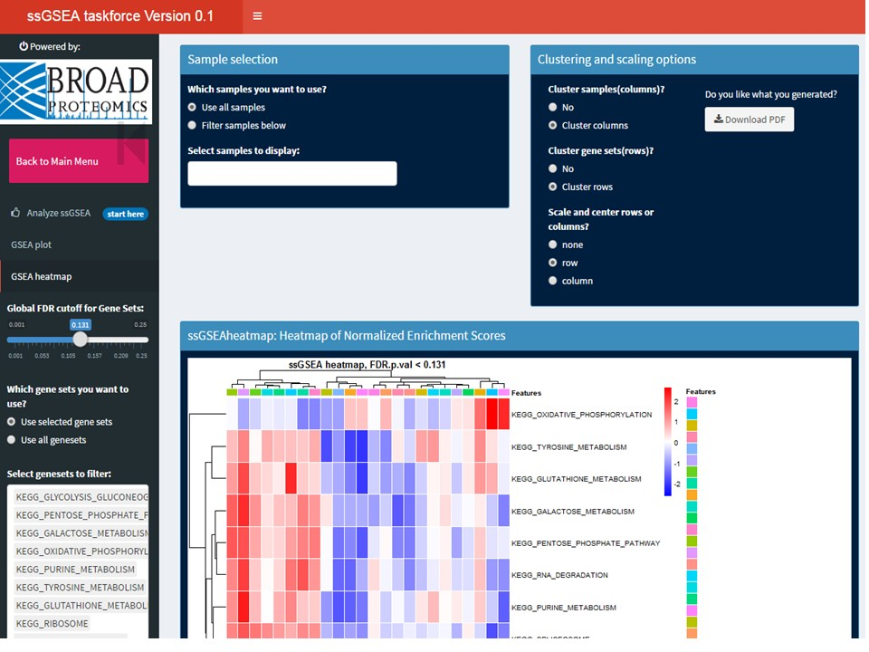

- The same features about FDR/Gene set/Treatment filtering described for the ssGSEA plots also applies to the heatmap. 
- User have the option to cluster and/or scale the rows and/or columns.
- The legend will contain a scale bar for gene enrichment scores as well as a color key for the treatments.
- Finally, the heatmap can be downloaded as a PDF file.

# Acknowledgements

I would like to thank Karsten Krug for providing the source code for the sGSEAplot and D.R. Mani for providing the ssGSEA script.

# References

GSEA algorithm was originally developed by Aravind Subramanian. ssGSEA algorithm is a modified version developed by Pablo Tamayo and modified by D.R. Mani.

Key references:

1. Abazeed, M. E., Adams, D. J., Hurov, K. E., Tamayo, P., Creighton, C. J., Sonkin, D., et al. (2013).Integrative Radiogenomic Profiling of Squamous Cell Lung Cancer. Cancer Research, 73(20).

2. Subramanian, A., Tamayo, P., Mootha, V. K., Mukherjee, S., Ebert, B. L., Gillette, M. A., et al. (2005),Gene set enrichment analysis: a knowledge-based approach for interpreting genome-wide expression profiles. Proceedings of the National Academy of Sciences of the United States of America, 102(43).